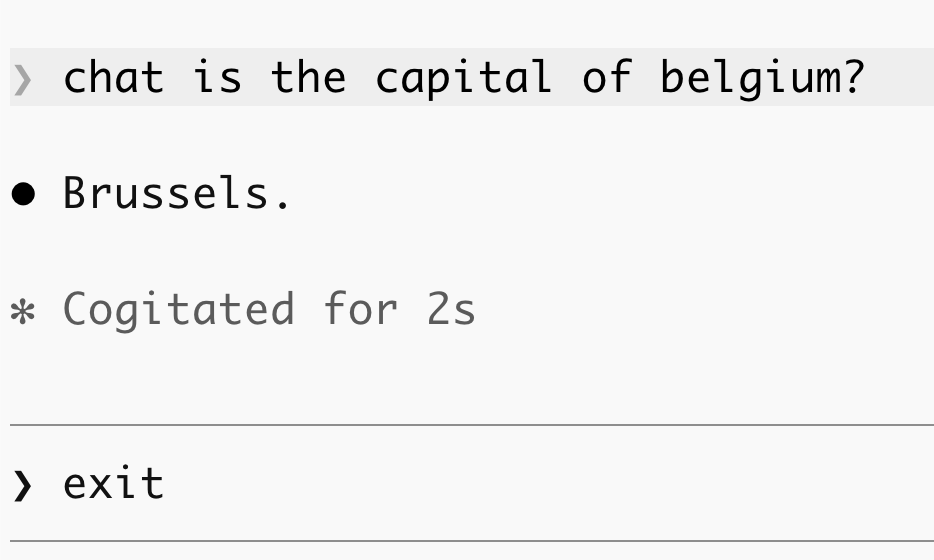
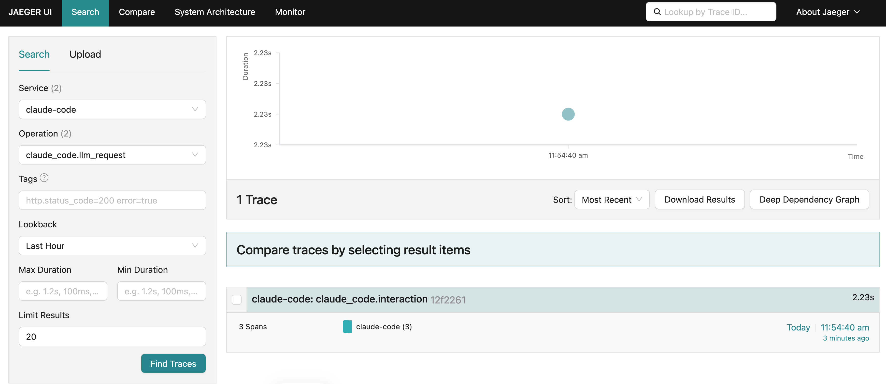
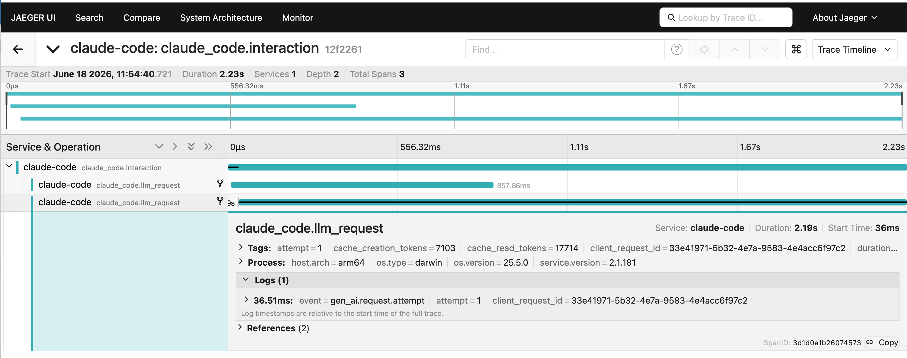

# claude-code-telemetry

POC on how to extract **Claude Code** usage from the various ~./claude/ files 
and **emit telemetry to OTEL/Azure**.

**Cursor** support may be added to this repo at a later date.

## The Problem to Solve

- Claude Code is an excellent AI tool/assistant
- However, it provides little insight into when it calls LLM(s) and the token utilization
- It provides little insight on how/when/if Skills and Sub-agents are called

### Solution Goals

- Collecting and viewing this telemetry either locally, or to Azure
- Utilize the OpenTelemetry (OTEL) standard API
- If custom code is required, then use Python

### Solutions in this Repo

This repo explores three ways to solve this problem:
- 1. Per the Claude Code documentation, send OTEL telemetry to a localhost container
- 2. Per the Claude Code documentation, send OTEL telemetry to Azure
- 3. With a custom python-based solution to capture and emit  OTEL telemetry

### System Requirements

- Claude Code 
- Docker Desktop (for telemetry sent to localhost)
- Azure App Insights and Azure Log Analytics (for telemetry sent to Azure)
- Python 3.13 (for custom solution)

---

## Part 1 : Implement OTEL to localhost per the Claude Code Documentation

See https://code.claude.com/docs/en/monitoring-usage


### Environment Variables

Per the above Claude documentation, set these environment variables on your system
to emit Claude telemetry to the OpenTelemetry Docker Container described below.

```
CLAUDE_CODE_ENABLE_TELEMETRY=1
CLAUDE_CODE_ENHANCED_TELEMETRY_BETA=1
OTEL_EXPORTER_OTLP_ENDPOINT=http://localhost:4318
OTEL_EXPORTER_OTLP_PROTOCOL=http/protobuf
OTEL_LOG_USER_PROMPTS=1
OTEL_LOGS_EXPORT_INTERVAL=5000
OTEL_LOGS_EXPORTER=otlp
OTEL_METRICS_EXPORT_INTERVAL=10000
OTEL_METRICS_EXPORTER=otlp
OTEL_TRACES_EXPORT_INTERVAL=10000
OTEL_TRACES_EXPORTER=otlp
```

After these environment variables have been set **restart Claude Code**.

### Localhost OpenTelemetry Docker Container

See https://opentelemetry.io/docs/collector/quick-start/

In your shell program, start the collector with Docker Compose:

```
docker compose -f otel-compose.yml up
```

See the **otel-compose.yml** and **otel-collector-config.yml** regarding
the Docker desktop configuration.  Notice how this configuration logs
the collected telemetry to the local **otel-logs/** directory.

Open Claude Code and enter any prompt, such as "What is the capitol of France?".

You will then see that telemetry has been emitted to file **otel-logs/telemetry.jsonl**.
The format of this file is JSON-document-per-line, or JSONL.  The **jq** program
can be used to pretty-print this telemetry.

```
cat telemetry.jsonl | tail -1 | jq
```

While this Docker container provides a UI at port 55679, it appears
to be primitive and difficult to use.

Stop the container with is command:
```
docker compose -f otel-compose.yml down
```

Also exit then restart your Claude session.

### Alternative Localhost Implementation with the Jaeger Container

**Jaeger** is another implementation of an OTEL collector.  See the docs here:
- https://www.jaegertracing.io/
- https://www.jaegertracing.io/docs/2.19/

Jaeger has a nicer and easier to use UI, IMO.

Start the Docker container with this command:
```
docker compose -f jaeger-compose.yml up
```

Reopen Claude Code and enter a prompt like the following:
<p align="center">
   
</p>

Then visit **http://localhost:16686/** with your browser and enter
search criteria like the following, then click "Find Traces".

<p align="center">
   
</p>

You should then be able to click-into a search result and see detail like the following.
You can click into these traces to see the token utilization, models used, and elapsed times.

<p align="center">
   
</p>

Be sure to stop the Docker container when appropriate:
```
docker compose -f jaeger-compose.yml down
```

Be sure to check that no container are still running with the **docker ps** command,
then stop them with the **docker stop** command as shown below.
```
docker ps
f0480e735356   jaegertracing/all-in-one:latest   "/go/bin/all-in-one-…"   22 minutes ago   Up 22 minutes   0.0.0.

docker stop f0480e735356
f0480e735356
```

---

## Part 2 : Implement OTEL to Azure per the Claude Code Documentation

See https://code.claude.com/docs/en/monitoring-usage

---

## Part 3: Custom Python-based solution to emit OTEL telemetry

- Claude Code writes local files to the ~/.claude/ directory as it executes
  - This directory structure doesn't seem to be documented
